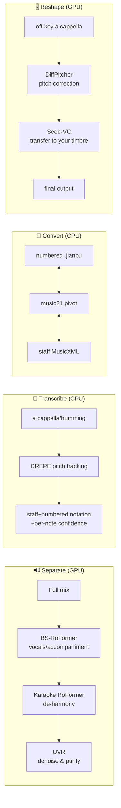

<div align="center">


# 🎵 MusicMaster · 声谱坊

[中文](README.md) · **English**

### A fully local, browser-based little tool that folds top-tier open-source music AI into one warm-ink interface —<br/>four tabs for **Separate · Transcribe · numbered⇄staff Convert · vocal Reshape**.

*Four jobs, one interface, all running on your own machine.*

[](LICENSE)
[](NOTICE)
[](pyproject.toml)
[](#-quick-start)
[](#-fully-local--cli--an-honest-license-list)
[](https://github.com/Cohenjikan/MusicMaster/stargazers)

<br/>


<sub>▶︎ Full promo video: <a href="docs/assets/promo.mp4">docs/assets/promo.mp4</a></sub>

</div>

---

> **No more transcribing by ear:** sing in, get staff notation + numbered notation + per-note confidence out.
> An off-key a cappella, repaired into something in-tune and clean — yet still your own voice.
> Code is Apache-2.0, the license is spelled out plainly — we even tell you honestly which weights you can't use commercially.

It is not a wrapper around a single model, but an **orchestration** of many first-rate open-source models — **BS-RoFormer, Mel-Band Karaoke RoFormer, UVR, CREPE, basic-pitch, ByteDance, DiffPitcher, Seed-VC, music21, Verovio** — into four **verified** pipelines. This project only does **orchestration and bridging**; it does not change any upstream inference recipe.

**Who it's for:** amateur singers, music hobbyists, people who need to transcribe songs to score (扒谱), and local-first / privacy-minded users.

---

## ✨ What it can do

| | Capability | What you get | Compute |
|---|---|---|---|
| 🔊 | **Separate** | One song → vocals / accompaniment → de-harmony pure lead → denoised clean lead. Multiple stems to compare; use the clean lead for karaoke, transcription, or reshaping | GPU |
| 🎤 | **Transcribe** | a cappella / humming → staff notation + numbered notation + **per-note confidence**; uncertain spots auto-flagged so you review just those notes, not the whole score on faith | CPU |
| 🎼 | **Convert** | numbered `.jianpu` ⇄ staff `MusicXML`, core scale-degree sequence **lossless** round-trip; numbered-notation folks get MuseScore/Finale-openable scores, staff folks get numbered notation back | CPU |
| 🎚️ | **Reshape** | off-key a cappella → **in tune + clean + still your own timbre** (two stages: pitch correction → transfer back to your own voice) | GPU |

> Once opened, it's a web interface (hosted by a local FastAPI service); the four tabs correspond to the four jobs above.
> ✅ **Convert / Transcribe** are pure CPU — usable as soon as the core env is installed; ⚙️ **Separate / Reshape** need extra GPU environments (see below). When those aren't set up, the two tabs just show a friendly notice and the CPU tabs are unaffected.

<div align="center">
<table>
<tr>
<td></td>
<td></td>
</tr>
<tr>
<td align="center"><sub>🔊 Separate (blue)</sub></td>
<td align="center"><sub>🎤 Transcribe (amber)</sub></td>
</tr>
<tr>
<td></td>
<td></td>
</tr>
<tr>
<td align="center"><sub>🎼 Convert (green)</sub></td>
<td align="center"><sub>🎚️ Reshape (pink)</sub></td>
</tr>
</table>
</div>

---

## 🌟 Why this one (differentiators)

- 🎯 **Not a single-model wrapper** — it orchestrates many first-rate open-source models into four **verified** pipelines; the project only orchestrates and bridges, never altering the upstream inference recipes.
- 🔍 **Transcription carries "per-note confidence" and raises its hand** — most transcription tools just hand you a score and never tell you which notes are untrustworthy. This one flags runs of out-of-key notes as "uncertain", with **neutral wording** (could be a transcription error, or you genuinely sang an accidental) — never a blunt verdict.
- 🤝 **Brutally honest about licensing** — the code is clean Apache-2.0, and "which model weights are non-commercial" is written right into the README and NOTICE as a **trust feature**, not glossed over.
- 🀄 **Native-friendly for Chinese / numbered notation** — first-class support for numbered notation (`.jianpu`) and numbered-notation PDF rendering (requires a local LilyPond install), with bidirectional translation to the international MusicXML; a rare combination for Chinese-speaking music lovers.
- 🔒 **Fully local, privacy-first** — audio is processed on your own machine; heavy GPU work runs in isolated venvs to avoid dependency conflicts, and the CPU features work out of the box.
- 🪞 **Reshape preserves "your own timbre" rather than cloning someone else** — it uses your own a cappella as the timbre anchor, only correcting pitch and purifying, so identity doesn't drift (red-line tests lock in the verified recipe: `shift=-12`, `auto_f0_adjust=False`, etc.).

---

## 🚀 Quick start

> ⚠️ Do not run with system Python — dependencies live in the project's bundled virtual environment `.venv`.

```bash
git clone https://github.com/Cohenjikan/MusicMaster.git
cd MusicMaster

# 1) One-click main environment (CPU): create .venv + install TensorFlow + crepe (--no-deps) + remaining deps + this package
python scripts/setup_core.py

# 2) Launch (Windows: double-click 启动.bat; command line works too)
启动.bat
# macOS / Linux:
./start.sh
```

After launch the browser opens **`http://127.0.0.1:7860`** automatically (it falls through to the next free port if taken); the four tabs are the four capabilities — and **Convert / Transcribe (crepe)** are usable right now.

> 🟢 **At this point, the two CPU tabs (Convert / Transcribe) already work.** Separate / Reshape are optional GPU add-ons — see the two sections below.

**(Optional) Numbered-notation PDF:** install [LilyPond](https://lilypond.org) locally (GPL, invoked only as a standalone subprocess) and set the environment variable `LILYPOND_EXE` to its executable. It still works without it — numbered notation just outputs a `.ly` source instead of PDF, and staff notation (Verovio) is unaffected.

---

## ⚠️ The honest part (trust is a feature — please read)

We don't hide this — these are the boundaries you should know before you start.

<table>
<tr><th>🟢 Works out of the box (CPU)</th><th>⚙️ Needs extra setup (GPU)</th></tr>
<tr>
<td valign="top">
Convert / Transcribe work as soon as the core env is installed — no GPU.
</td>
<td valign="top">
Separate / Reshape need <code>scripts/setup_sep.py</code> + <code>scripts/setup_vocal.py</code> to build separate venvs and pull weights; <b>≥ 8GB VRAM</b> recommended. Until configured, those tabs only show a friendly notice.
</td>
</tr>
</table>

- 🧾 **License red line (an honesty point we must keep):** the project **code is Apache-2.0 and license-clean**; but **some model weights are non-commercial** (CC-BY-NC-SA / treated as NC) — the de-harmony Karaoke RoFormer, ByteDance piano (MAESTRO), Demucs (MUSDB18). **Personal / research use is free; commercial use must swap these weights or obtain separate licenses.**
- 🔗 **No copyleft contamination:** Verovio is LGPL (loaded as a dynamic library); LilyPond / FFmpeg are GPL (FFmpeg may be LGPL depending on the build, and here it is called only as a standalone CLI subprocess) — **none statically linked, so copyleft does not infect this project's code**.
- 🎼 **The ~88/100 transcription figure is not a general accuracy rate:** it's a **single sample of one chorus vs an authoritative score**; only a **synthetic scale** is note-exact. Don't read it as a guarantee for every song.
- 🪞 **Reshape repairs "you":** it corrects an off-key a cappella and preserves / restores **your own** timbre (the `self` timbre anchor) — it is **not arbitrary target-singer voice cloning**. The `cfg` ("closeness to your voice") knob is officially "**subtle**" — turning it does little. A full song at high precision may take **20+ minutes**.
- 🚫 **Don't misread Convert:** MIDI / ABC are formats that music21 can **read in**; the **verified lossless round-trip is only numbered → MusicXML → numbered (character-identical)**; the output side only produces MusicXML or `.jianpu` text.
- ⏱️ **Not real-time:** separation may take minutes, a full-song high-precision reshape may take 20+ minutes. Be patient with GPU jobs.
- 🧪 **Single verification environment:** the above was validated on Windows / Python 3.11 / RTX 4060 Laptop 8GB / CUDA 12.4.

---

## 🎁 The four capabilities · what you get + how it's done

### 🔊 Separate (GPU) — three-stage cascade vocal separation

> **You get:** drop in one song and automatically get multiple stems — vocals / accompaniment / de-harmony pure lead / denoised clean lead. Make karaoke, or take the clean lead for transcription or reshaping, and compare stems to pick the best.

**How it's done:** `separate/pipeline.py` cascades three stages in order —
`stage_separate` (**BS-RoFormer** `model_bs_roformer_ep_317`) → `stage_deharmony` (**Mel-Band Karaoke RoFormer** `gabox_v2`) → `stage_denoise` (**UVR-DeEcho-DeReverb** default / `De-Echo-Normal`). Users can pick a `--stages` subset; `runners.run_separate` streams subprocess progress, and outputs are labelled by `runners._friendly()` as "vocals-with-harmony / de-harmony lead / denoised clean / accompaniment / final".

> 💡 The main separation chain is **BS-RoFormer → Karaoke RoFormer → UVR**; Demucs is only a **fallback** separator inside `core`, not the main chain.

**Choosing the cleanup model** — both cleanup models exist to make the vocal cleaner, **not "pick one to remove a certain thing"**:

- **De-reverb (default)** — `UVR-DeEcho-DeReverb`, already suppresses both reverb and echo at once, stable volume, not muffled;
- **De-echo** — only needed when the original recording's echo is especially heavy.

### 🎤 Transcribe (CPU) — a cappella / humming → staff + numbered notation + per-note confidence

> **You get:** even people who can't transcribe can turn a melody they sang into a score. The system first gives the recording a "checkup", then **auto-flags the few spots it can't hear clearly**, so you only review those notes instead of trusting the whole score blindly. The per-note confidence panel looks like the "Transcribe (amber)" tab screenshot above.

**How it's done:** `transcribe/autopilot.py` chains **L1** `quality_gate.assess` (entry checkup) → engine transcription (`crepe` default) → robust key detection → render MIDI / MusicXML / staff / numbered → **L3** `confidence.assess`. `confidence.py` derives per-note confidence from "music-theory plausibility × dual-algorithm disagreement × tracker confidence × global gate", flagging only runs of out-of-key notes as "uncertain" with **neutral wording** (could be wrong, or you really sang an accidental); `runners._parse_confidence` dynamically parses `confidence.json`'s `passages[start_s, end_s, reasons, min_conf]`. The test `test_transcribe_synthetic_scale_crepe` asserts a synthetic scale is note-exact.

**Pick the right "ear" (engine) by material** — picking wrong won't crash (a checkup screens the material at the door):

| Material | Engine | Notes |
|---|---|---|
| Singing / humming / **single melody** | `crepe` (default) | Deep pitch tracking for single melody, most stable for vocals, **also produces numbered notation + per-note confidence** (pure CPU) |
| Instruments / chords / **multiple simultaneous notes** | `basic-pitch` | General-purpose polyphonic note detection; **do not use for vocals**. Requires TensorFlow 2.15 |
| **Clean solo piano** | `bytedance` | Piano-specific high resolution; **clean 44.1k real piano only**, low-quality audio will hallucinate phantom notes |

> ⚠️ The polyphonic engines (`basic-pitch` / `bytedance`) produce **staff notation only** — no numbered notation and no confidence. Numbered notation + per-note confidence are exclusive to the `crepe` single-melody chain.

### 🎼 Convert (CPU) — bidirectional numbered ⇄ staff notation

> **You get:** numbered-notation and staff-notation folks each get what they need — numbered text becomes MusicXML that MuseScore / Finale can open, and staff notation translates back to numbered notation, with the **core scale-degree sequence preserved round-trip**.

**How it's done:** `convert/convert.py` uses **music21.Score** as the pivot: `parse_jianpu` parses the `.jianpu` mini-format (key / time signature / rhythm / accidentals / octaves), `score_to_jianpu` translates back and `stripTies` merges tied notes; `load_any` can also **read in** MusicXML / MIDI / ABC. The test `test_convert_roundtrip_lossless` asserts that `twinkle.jianpu → Score → jianpu` keeps the opening scale degrees "`1 1 5 5 6 6 5`" identical.

> 📌 The verified lossless round-trip is **numbered → MusicXML → numbered (character-identical)**; MIDI / ABC are **import** formats, and the output side only produces MusicXML or `.jianpu`.

<div align="center">

<br/><sub>Real run · numbered <code>twinkle.jianpu</code> → staff notation (rendered live by Verovio)</sub>
</div>

### 🎚️ Reshape (GPU) — off-key a cappella → in-tune, clean, still you

> **You get:** an amateur, off-key a cappella can be repaired into something in-tune and clean — and the **timbre is still your own**, not turned into someone else's voice.

**How it's done:** `vocal/pipeline.py`'s `two_stage` —
**Stage 1** `DiffPitcher` corrects pitch (`correct`, `shift=-12`, 150 steps by default) → resample to 44.1k → **Stage 2** `Seed-VC` uses `self_ref` as the timbre anchor to transfer back to you (`voice`, 50 steps by default, `cfg 0.7`). `test_vocal_redlines_locked` locks these defaults and `auto_f0_adjust=False` (no automatic transposition, to avoid identity drift). `runners.run_vocal` infers progress from intermediate artifacts (`corrected_24k/44k → vc` final).

**Three inputs (all required, don't mix them up):**
1. **Your original singing** (off-key is fine);
2. **The way you want it to sound** — a clean **de-harmony** reference of the target melody (you can first use "Separate" to split clean / lead from the original track; **do not use the full original track directly**);
3. **A sample of your voice** — a clean a cappella clip of ~10–30s (the timbre anchor, which decides who the output "sounds like").

> Be sure to align **line by line**: ① and ② must be completely consistent in **total duration, the start/end of each phrase, and rhythmic pattern**, otherwise the pitch correction will be misaligned.

**Three knobs:**
- **Pitch fine-tuning** (`diffusion steps` 50–200, default 150) — higher = finer but slower; drop to 50 for speed;
- **Timbre fineness** (`reshape steps` 20–100, default 50) — higher = finer but slower; 25 is enough;
- **Closeness to your voice** (`cfg` 0–1, default 0.7) — officially "**subtle**"; to sound more like yourself, **prioritize a cleaner / longer "voice sample" and raise "timbre fineness"** — far more effective than turning this knob.

> The whole song is auto-chunked and fully reshaped (no truncation); but longer and finer means slower (a full song at high precision may take 20+ minutes — try a chorus clip first for speed).

---

## 🖼️ How it works

**Inputs and outputs of the four capabilities:**



**How the interface ↔ backend are wired together:**


> Long tasks (Separate, Reshape) follow a "submit → get job_id → poll progress → fetch result / download on completion" model, so the page never freezes (`JobManager` runs an in-process async thread pool). The download endpoint `/api/file/{id}/{name}` has directory-traversal protection; default is `127.0.0.1:7860` (`MUSICMASTER_HOST` configurable, falls through via `_free_port` if taken).
> A more detailed flowchart of "which models each layer uses" is in **[docs/架构流程图.md](docs/架构流程图.md)**.

---

## 🎨 A crafted warm-ink interface

The tool looks good and feels substantial — not the cookie-cutter demo vibe of a default framework.

- 🖋️ **Warm-ink dark theme + Fraunces serif typography** (self-hosted woff2, `@font-face`; Chinese falls back to system serifs).
- 💿 **A spinning vinyl record `.vinyl` (grooves / gloss / center label) + tonearm `.tonearm`** that lifts and lowers with playback — it *is* the audio player.
- 🌈 **Per-tab accent colors** `--accent`: Convert `#4ade80` green · Transcribe `#fbbf24` amber · Separate `#7aa2f7` blue · Reshape `#fb7299` pink.

> See `musicmaster/web/static/index.html`.

---

## 🎮 GPU feature setup (Separate / Reshape)

These two use top-tier GPU models, each with its own dedicated venv (their dependencies conflict — **do not mix-install**):

```bash
python scripts/setup_sep.py      # separation environment .venv-sep (audio-separator + CUDA torch)
python scripts/setup_vocal.py    # pitch correction .venv-neural (DiffPitcher) + timbre transfer .venv-svc (Seed-VC) + fetch weights
```

The scripts pull source code under `vendor/`, build the corresponding venvs, and download weights. Once done, tell the program the paths (priority: **environment variables > `paths.local.json`**): copy `paths.local.json.example` to `paths.local.json` and fill it in (use forward slashes `/`); this file is not checked in and is read automatically at startup.

| `paths.local.json` key / environment variable | Points to |
|---|---|
| `sep_python` / `MUSICMASTER_SEP_PYTHON` | python of the separation venv (.venv-sep) |
| `diffpitcher_dir` / `MUSICMASTER_DIFFPITCHER_DIR` | DiffPitcher directory (contains run_qt4 + ckpts) |
| `vocal_python` / `MUSICMASTER_VOCAL_PYTHON` | python of the pitch-correction venv (.venv-neural) |
| `seedvc_dir` / `MUSICMASTER_SEEDVC_DIR` | Seed-VC directory (contains inference.py) |
| `svc_python` / `MUSICMASTER_SVC_PYTHON` | python of the timbre-transfer venv (.venv-svc) |

> Recommended VRAM **≥ 8GB**. When no GPU environment is configured, these two tabs show a friendly notice **without affecting the two CPU tabs**.

---

## ⚡ Command line (works without opening the interface)

```bash
musicmaster gui                                   # Launch the local web interface (= python -m musicmaster.web.server)
musicmaster transcribe 清唱.wav --out 输出 --engine crepe --key C   # Transcribe
musicmaster convert 某.jianpu --to musicxml --render               # Convert
musicmaster render 某.musicxml -o 输出                              # Render (MusicXML → staff + numbered notation)
musicmaster separate 混音.wav --stages 1,2,3                        # Separate (requires GPU venv)
python -m musicmaster.vocal.pipeline --raw 清唱.wav --ref 去和声.wav --self 你的清唱.wav --out 输出  # Reshape (requires GPU venv)
```

---

## 🔒 Fully local · CLI · an honest license list

- 🛡️ **Audio never leaves your machine** — a `127.0.0.1` local service; only first-time model weights download from the network. Privacy-friendly.
- 🧰 **Usable without the interface, for batch processing** — `musicmaster/cli.py` provides `gui / transcribe / convert / render / separate / vocal` subcommands.
- 🧾 **The license list is spelled out plainly** — `LICENSE` is Apache-2.0, and `NOTICE` annotates every component's role and license (Karaoke RoFormer / Demucs MUSDB18 / ByteDance MAESTRO marked non-commercial, Verovio LGPL dynamic library, LilyPond / FFmpeg GPL subprocess-only).

---

## 📁 Project structure

```
MusicMaster/
├─ 启动.bat / start.sh          # Launcher: starts the local web service and opens the browser (main entry)
├─ README.md / README.en.md     # Docs (Chinese / English)
├─ LICENSE · NOTICE             # Apache-2.0 + third-party component/model attribution and licenses
├─ pyproject.toml               # Package and dependency declarations (incl. pytest config)
├─ musicmaster/                 # ← source code proper
│  ├─ web/                      # FastAPI bridge layer
│  │  ├─ server.py              #   Routes: static hosting + /api submit/poll/download
│  │  ├─ jobs.py                #   In-process async job management
│  │  ├─ runners.py             #   Execution bodies of the four functions (reuse verified core)
│  │  └─ static/               #   Design-spec frontend: index.html + js/ + self-hosted fonts
│  ├─ separate/                 # Three-stage vocal separation (audio-separator, GPU)
│  ├─ transcribe/              # Transcription: quality gate → multi-engine → key detection → render → confidence
│  ├─ convert/                 # Numbered ⇄ staff notation translation and import
│  ├─ vocal/                   # Pitch correction (DiffPitcher) + timbre transfer (Seed-VC) subprocess wrappers
│  └─ core/                     # Shared base: data contracts + score rendering (Verovio / jianpu-ly)
├─ scripts/                     # setup_core / setup_sep / setup_vocal
├─ requirements/                # Layered dependencies (core / sep / vocal)
├─ tests/                       # pytest (contracts / translation round-trip / synthetic transcription / rendering / red-line lock)
├─ docs/                        # 架构流程图.md · 前端开发文档.md · 合并开发日志.md
└─ examples/                    # Examples (twinkle.jianpu, public domain)
```

---

## 📦 Dependencies and licenses

MusicMaster's **own code is open-sourced under [Apache-2.0](LICENSE)**, and at runtime it integrates the following third-party components and models (full list and roles in [NOTICE](NOTICE)):

| Stage | Main components | License |
|---|---|---|
| Separate | [audio-separator](https://github.com/nomadkaraoke/python-audio-separator) · BS-RoFormer · Mel-Band Karaoke RoFormer · UVR · [Demucs](https://github.com/facebookresearch/demucs) (fallback) | MIT (code); some **weights CC-BY-NC-SA** |
| Transcribe | [CREPE](https://github.com/marl/crepe) · [torchcrepe](https://github.com/maxrmorrison/torchcrepe) · [basic-pitch](https://github.com/spotify/basic-pitch) · [ByteDance piano transcription](https://github.com/qiuqiangkong/piano_transcription_inference) · [music21](https://github.com/cuthbertLab/music21) · [librosa](https://github.com/librosa/librosa) | MIT / Apache-2.0 / BSD-3 / ISC; ByteDance **weights CC-BY-NC-SA** |
| Render | [Verovio](https://github.com/rism-digital/verovio) · [jianpu-ly](https://github.com/ssb22/jianpu-ly) · [LilyPond](https://lilypond.org) | LGPL-3.0 (library) / Apache-2.0 / GPL-3.0 (subprocess only) |
| Reshape | [DiffPitcher](https://github.com/haidog-yaqub/DiffPitcher) · [BigVGAN](https://github.com/NVIDIA/BigVGAN) · [Seed-VC](https://github.com/Plachtaa/seed-vc) · [pyworld](https://github.com/JeremyCCHsu/Python-Wrapper-for-World-Vocoder) | mostly MIT / Apache-2.0 |
| Interface | [FastAPI](https://github.com/fastapi/fastapi) · Uvicorn · Starlette · Pydantic · python-multipart | MIT / BSD-3 / Apache-2.0 |
| Fonts | [Fraunces](https://github.com/undercasetype/Fraunces) · [Inter](https://github.com/rsms/inter) · [JetBrains Mono](https://github.com/JetBrains/JetBrainsMono) | SIL Open Font License 1.1 |

### License compatibility

- **The code side is entirely compatible with Apache-2.0 distribution**: permissive licenses MIT / BSD-3 / ISC / Apache-2.0 can be integrated directly; **Verovio (LGPL) is loaded as a dynamic library**, **LilyPond / FFmpeg (GPL) are invoked only as standalone CLI subprocesses** — none are statically linked, so copyleft does not infect this project's code.
- ⚠️ **Commercial-use notice (key)**: some **model weights** are **CC-BY-NC-SA (non-commercial)** — the de-harmony Karaoke RoFormer, ByteDance piano (MAESTRO), Demucs (MUSDB18), etc. **Personal / research use is free**; for **commercial use**, replace these items with commercially usable weights or obtain a separate license (this project's code itself is unaffected).
- The self-hosted fonts are all OFL 1.1, allowing bundled distribution with the software (the full text of each license is included under `musicmaster/web/static/fonts/`).

---

## ✅ Verified

- Translation round-trip is **lossless** (numbered notation → MusicXML → numbered notation, character-for-character identical);
- Transcription end-to-end (synthetic scale exact per note; real chorus vs authoritative score ~88/100, a **single sample, not a general accuracy rate**);
- Staff notation (Verovio) renders correctly; numbered notation (LilyPond) outputs PDF;
- Pitch correction & timbre transfer two-stage GPU full chain runs through (DiffPitcher → Seed-VC);
- Web interface four tabs verified end-to-end (upload → submit → poll → result / download).

Environment: Windows / Python 3.11 / RTX 4060 Laptop 8GB (CUDA 12.4).

---

## 🙏 Acknowledgements

MusicMaster **stands on the shoulders of giants** — it integrates the many excellent open-source projects and models above into an out-of-the-box local tool, and we thank them all here. Each component's copyright belongs to its authors and is distributed under its respective license; this project only does orchestration and bridging, and does not modify any upstream verified inference recipe.

---

<div align="center">

**An all-in-one local music atelier, built on the shoulders of giants.** 🎵
[⭐ Star on GitHub](https://github.com/Cohenjikan/MusicMaster) · [中文 README](README.md)

<sub>MusicMaster · open-source project · code <a href="LICENSE">Apache-2.0</a> · weights see <a href="NOTICE">NOTICE</a> · please only process audio you own the rights to or are authorized to use</sub>

</div>