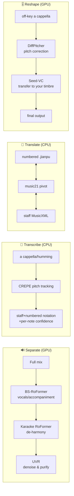
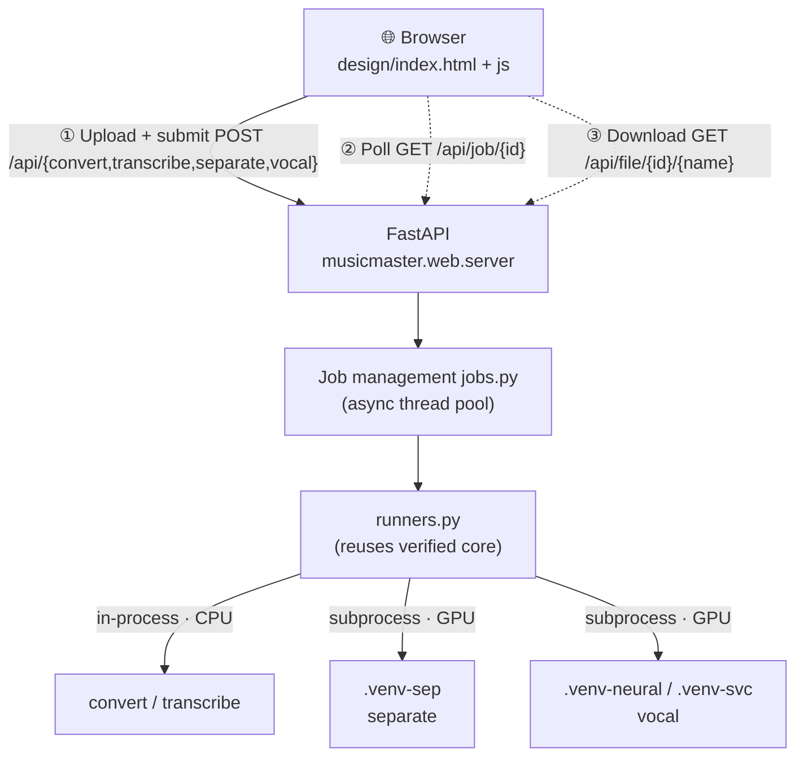

<div align="center">

# 🎵 MusicMaster

[中文](README.md) · **English**

**All-in-one local music processing toolkit — Vocal separation · Audio transcription · Numbered ⇄ staff notation translation · Vocal repair & timbre transfer**

Runs fully local · Open source · Integrates multiple top-tier open-source models · Four jobs done in one browser interface

</div>

---

## ✨ What it can do

| | Capability | What it does | Compute |
|---|---|---|---|
| 🔊 | **Separate** | One song → vocals / accompaniment → de-harmony pure lead → denoised clean lead (three-stage cascade) | GPU |
| 🎤 | **Transcribe** | a cappella / humming → staff notation + numbered notation + **per-note confidence** (uncertain spots auto-flagged for your review) | CPU |
| 🎼 | **Translate** | numbered notation `.jianpu` ⇄ staff notation `MusicXML / MIDI / ABC`, **lossless** in both directions | CPU |
| 🎚️ | **Reshape** | off-key a cappella → **in tune + clean + still your own timbre** (two stages: pitch correction → timbre transfer) | GPU |

> Once opened, it's a web interface (hosted by a local FastAPI service); the four tabs correspond to the four jobs above.
> **Translate / Transcribe** are pure CPU — usable as soon as installed; **Separate / Reshape** require a GPU environment (see below).

---

## 🚀 Quick start

> ⚠️ Do not run with system Python — dependencies are installed in the project's bundled virtual environment `.venv`.

```bash
git clone https://github.com/Cohenjikan/MusicMaster.git
cd MusicMaster

# 1) One-click main environment (CPU): create .venv + install TensorFlow + crepe (--no-deps) + remaining deps + this package
python scripts/setup_core.py

# 2) Launch (Windows: double-click 启动.bat; command line works too)
启动.bat
# macOS / Linux:
./start.sh
```

After launch the browser automatically opens `http://127.0.0.1:7860`; the four tabs are the four capabilities; **Translate / Transcribe (crepe)** are usable right away.

> **Numbered notation PDF rendering** requires [LilyPond](https://lilypond.org) installed locally (GPL, invoked only as a standalone subprocess), with the environment variable `LILYPOND_EXE` pointing to its executable; it still works without it, only the numbered notation outputs a `.ly` source instead of PDF, and staff notation (Verovio) is unaffected.

---

## 🖼️ How it works

**Inputs and outputs of the four capabilities:**



**How the interface ↔ backend are wired together:**



> Long tasks (Separate, Reshape) follow a "submit → get job_id → poll progress → fetch result / download on completion" model, so the page never freezes.
> A more detailed flowchart of "which models each layer uses" is in **[docs/架构流程图.md](docs/架构流程图.md)**.

---

## 🧭 The four capabilities · how to choose and use them

### 🎤 Transcribe — which "ear" (engine) to pick

Different material calls for different algorithms; picking wrong won't crash (a checkup at the door screens the material first, flagging spots it can't hear clearly for you):

| Material | Engine | Notes |
|---|---|---|
| Singing / humming / **single melody** | `crepe` (default) | Deep pitch tracking for single melody, most stable for vocals, **also produces numbered notation + per-note confidence** (pure CPU) |
| Instruments / chords / **multiple simultaneous notes** | `basic-pitch` | General-purpose polyphonic note detection; **do not use it for vocals**. Requires TensorFlow 2.15 |
| **Clean solo piano** | `bytedance` | Piano-specific high resolution; **only for clean 44.1k real piano**, low-quality audio will hallucinate phantom notes |

### 🔊 Separate — which cleanup model to use for "washing out noise"

Both cleanup models exist to make the vocal cleaner, **not "pick one to remove a certain thing"**:

- **De-reverb (dereverb, default)** — model `UVR-DeEcho-DeReverb`, already able to suppress both reverb and echo at once, stable volume, not muffled;
- **De-echo (deecho)** — only needed when the original recording's echo is especially heavy.

### 🎚️ Reshape — three inputs and three knobs

**Three inputs (all required, don't mix them up):**
1. **Your original singing** (off-key is fine);
2. **The way you want it to sound** — a clean **de-harmony** reference of the target melody (you can first use "Separate" to split clean / lead from the original track; **do not use the full original track directly**);
3. **A sample of your voice** — a clean a cappella clip of ~10–30s (serves as the timbre anchor, determines who the output "sounds like").

> Be sure to align line by line: ① and ② must be completely consistent in **total duration, the start/end of each phrase, and rhythmic pattern**, otherwise the pitch correction will be misaligned.

**Three knobs:**
- **Pitch fine-tuning** (`diffusion steps` 50–200, default 150) — higher means finer pitch correction but slower; lower to 50 if you want speed;
- **Timbre fineness** (`reshape steps` 20–100, default 50) — higher means finer audio quality but slower; 25 is also enough;
- **Closeness to your voice** (`cfg` 0–1, default 0.7) — in this version of the model its official positioning is "**subtle**"; to sound more like yourself, **prioritize swapping in a cleaner/longer "voice sample" and raising "timbre fineness"** — far more effective than turning this knob; set to 0 for fastest.

> The whole song is automatically chunked and fully reshaped (no truncation); but longer and finer means slower (a full song at high precision may take 20+ minutes — try a chorus clip first for speed).

---

## 🎮 GPU feature setup (Separate / Reshape)

These two use top-tier GPU models, each with its own dedicated venv (their dependencies conflict — **do not mix-install**):

```bash
python scripts/setup_sep.py      # separation environment .venv-sep (audio-separator + CUDA torch)
python scripts/setup_vocal.py    # pitch correction .venv-neural (DiffPitcher) + timbre transfer .venv-svc (Seed-VC) + fetch weights
```

The scripts pull source code under `vendor/`, build the corresponding venvs, and download weights. Once done, tell the program the paths (priority: **environment variables > `paths.local.json`**): copy `paths.local.json.example` to `paths.local.json` and fill it in (use forward slashes `/`); this file is not checked in and is read automatically at startup.

| `paths.local.json` key / environment variable | Points to |
|---|---|
| `sep_python` / `MUSICMASTER_SEP_PYTHON` | python of the separation venv (.venv-sep) |
| `diffpitcher_dir` / `MUSICMASTER_DIFFPITCHER_DIR` | DiffPitcher directory (contains run_qt4 + ckpts) |
| `vocal_python` / `MUSICMASTER_VOCAL_PYTHON` | python of the pitch-correction venv (.venv-neural) |
| `seedvc_dir` / `MUSICMASTER_SEEDVC_DIR` | Seed-VC directory (contains inference.py) |
| `svc_python` / `MUSICMASTER_SVC_PYTHON` | python of the timbre-transfer venv (.venv-svc) |

> Recommended VRAM ≥ 8GB. When no GPU environment is configured, these two tabs show a friendly notice without affecting normal use of the two CPU tabs.

---

## ⚡ Command line (works without opening the interface)

```bash
musicmaster gui                                   # Launch the local web interface (= python -m musicmaster.web.server)
musicmaster transcribe 清唱.wav --out 输出 --engine crepe --key C   # Transcribe
musicmaster convert 某.jianpu --to musicxml --render               # Translate
musicmaster render 某.musicxml -o 输出                              # Render (MusicXML → staff + numbered notation)
musicmaster separate 混音.wav --stages 1,2,3                        # Separate (requires GPU venv)
python -m musicmaster.vocal.pipeline --raw 清唱.wav --ref 去和声.wav --self 你的清唱.wav --out 输出  # Reshape (requires GPU venv)
```

---

## 📁 Project structure

```
MusicMaster/
├─ 启动.bat / start.sh          # Launcher: starts the local web service and opens the browser (main entry)
├─ README.md / README.en.md     # Docs (Chinese / English)
├─ LICENSE · NOTICE             # Apache-2.0 + third-party component/model attribution and licenses
├─ pyproject.toml               # Package and dependency declarations (incl. pytest config)
├─ musicmaster/                 # ← source code proper
│  ├─ web/                      # FastAPI bridge layer (newly added this round)
│  │  ├─ server.py              #   Routes: static hosting + /api submit/poll/download
│  │  ├─ jobs.py                #   In-process async job management
│  │  ├─ runners.py             #   Execution bodies of the four functions (reuse verified core)
│  │  └─ static/               #   Design-spec frontend: index.html + js/ + self-hosted fonts
│  ├─ separate/                 # Three-stage vocal separation (audio-separator, GPU)
│  ├─ transcribe/              # Transcription: quality gate → multi-engine → key detection → render → confidence
│  ├─ convert/                 # Numbered ⇄ staff notation translation and import
│  ├─ vocal/                   # Pitch correction (DiffPitcher) + timbre transfer (Seed-VC) subprocess wrappers
│  └─ core/                     # Shared base: data contracts + score rendering (Verovio / jianpu-ly)
├─ scripts/                     # setup_core / setup_sep / setup_vocal
├─ requirements/                # Layered dependencies (core / sep / vocal)
├─ tests/                       # pytest (contracts / translation round-trip / synthetic transcription / rendering / red-line lock)
├─ docs/                        # 架构流程图.md · 前端开发文档.md · 合并开发日志.md
└─ examples/                    # Examples (twinkle.jianpu, public domain)
```

---

## 📦 Dependencies and licenses

MusicMaster's **own code is open-sourced under [Apache-2.0](LICENSE)**, and at runtime it integrates the following third-party components and models (full list and roles in [NOTICE](NOTICE)):

| Stage | Main components | License |
|---|---|---|
| Separate | [audio-separator](https://github.com/nomadkaraoke/python-audio-separator) · BS-RoFormer · Mel-Band Karaoke RoFormer · UVR · [Demucs](https://github.com/facebookresearch/demucs) | MIT (code); some **weights CC-BY-NC-SA** |
| Transcribe | [CREPE](https://github.com/marl/crepe) · [torchcrepe](https://github.com/maxrmorrison/torchcrepe) · [basic-pitch](https://github.com/spotify/basic-pitch) · [ByteDance piano transcription](https://github.com/qiuqiangkong/piano_transcription_inference) · [music21](https://github.com/cuthbertLab/music21) · [librosa](https://github.com/librosa/librosa) | MIT / Apache-2.0 / BSD-3 / ISC; ByteDance **weights CC-BY-NC-SA** |
| Render | [Verovio](https://github.com/rism-digital/verovio) · [jianpu-ly](https://github.com/ssb22/jianpu-ly) · [LilyPond](https://lilypond.org) | LGPL-3.0 (library) / Apache-2.0 / GPL-3.0 (subprocess only) |
| Reshape | [DiffPitcher](https://github.com/haidog-yaqub/DiffPitcher) · [BigVGAN](https://github.com/NVIDIA/BigVGAN) · [Seed-VC](https://github.com/Plachtaa/seed-vc) · [pyworld](https://github.com/JeremyCCHsu/Python-Wrapper-for-World-Vocoder) | mostly MIT / Apache-2.0 |
| Interface | [FastAPI](https://github.com/fastapi/fastapi) · Uvicorn · Starlette · Pydantic · python-multipart | MIT / BSD-3 / Apache-2.0 |
| Fonts | [Fraunces](https://github.com/undercasetype/Fraunces) · [Inter](https://github.com/rsms/inter) · [JetBrains Mono](https://github.com/JetBrains/JetBrainsMono) | SIL Open Font License 1.1 |

### License compatibility

- **The code side is entirely compatible with Apache-2.0 distribution**: permissive licenses MIT / BSD-3 / ISC / Apache-2.0 can be integrated directly; **Verovio (LGPL) is loaded as a dynamic library**, **LilyPond / FFmpeg (GPL) are invoked only as standalone CLI subprocesses** — none are statically linked, so copyleft does not infect this project's code.
- ⚠️ **Commercial use notice (key)**: some **model weights** are **CC-BY-NC-SA (non-commercial)** — de-harmony Karaoke RoFormer, ByteDance piano (MAESTRO), Demucs (MUSDB18), etc. **Personal / research use is free**; for **commercial use**, replace these items with commercially usable weights or obtain a separate license (this project's code itself is unaffected).
- The self-hosted fonts are all OFL 1.1, allowing bundled distribution with the software (the full text of each license is included under `musicmaster/web/static/fonts/`).

---

## 🙏 Acknowledgements

MusicMaster **stands on the shoulders of giants** — it integrates the many excellent open-source projects and models above into an out-of-the-box local tool, and we thank them all here. Each component's copyright belongs to its authors and is distributed under its respective license; this project only does orchestration and bridging, and does not modify any upstream verified inference recipe.

---

## ✅ Verified

- Translation round-trip is **lossless** (numbered notation → MusicXML → numbered notation, character-for-character identical);
- Transcription end-to-end (synthetic scale exact per note; real chorus vs authoritative score ~88/100);
- Staff notation (Verovio) renders correctly; numbered notation (LilyPond) outputs PDF;
- Pitch correction & timbre transfer two-stage GPU full chain runs through (DiffPitcher → Seed-VC);
- Web interface four tabs verified end-to-end (upload → submit → poll → result / download).

Environment: Windows / Python 3.11 / RTX 4060 Laptop 8GB (CUDA 12.4).

---

<div align="center">
<sub>MusicMaster · open-source project · code <a href="LICENSE">Apache-2.0</a> · weights see <a href="NOTICE">NOTICE</a> · please only process audio you own the rights to or are authorized to use</sub>
</div>
