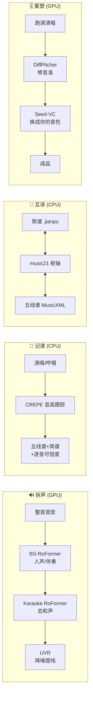

<div align="center">

# 🎵 声谱坊 · MusicMaster

**中文** · [English](README.en.md)

**一体化本地音乐处理工具 —— 人声分离 · 音频记谱 · 简谱⇄五线谱互译 · 修音换音色**

纯本地运行 · 开源 · 整合多个一线开源模型 · 一个浏览器界面搞定四件事

</div>

---

## ✨ 它能做什么

| | 能力 | 做什么 | 算力 |
|---|---|---|---|
| 🔊 | **拆声** | 一首歌 → 人声 / 伴奏 → 去和声纯主唱 → 降噪干净主唱(三段级联) | GPU |
| 🎤 | **记谱** | 清唱 / 哼唱 → 五线谱 + 简谱 + **逐音可信度**(不确定处自动标注请你复核) | CPU |
| 🎼 | **互译** | 简谱 `.jianpu` ⇄ 五线谱 `MusicXML / MIDI / ABC`,双向**无损** | CPU |
| 🎚️ | **重塑** | 跑调清唱 → **在调 + 干净 + 仍是你本人音色**(两段式:修音准 → 换音色) | GPU |

> 打开后是一个网页界面(本地 FastAPI 服务托管),四个页签对应上面四件事。
> **互译 / 记谱** 是纯 CPU,装好就能用;**拆声 / 重塑** 需要 GPU 环境(见下文)。

---

## 🚀 快速开始

> ⚠️ 不要用系统 Python 直接跑 —— 依赖装在项目自带的虚拟环境 `.venv` 里。

```bash
git clone https://github.com/Cohenjikan/MusicMaster.git
cd MusicMaster

# 1) 一键建主环境(CPU):建 .venv + 装 TensorFlow + crepe(--no-deps)+ 其余依赖 + 本包
python scripts/setup_core.py

# 2) 启动(Windows:双击 启动.bat;命令行同样可)
启动.bat
# macOS / Linux:
./start.sh
```

启动后浏览器自动打开 `http://127.0.0.1:7860`,四个页签即四大能力;**互译 / 记谱(crepe)** 此刻即可用。

> **简谱出图 PDF** 需本机装 [LilyPond](https://lilypond.org)(GPL,仅作独立子进程调用),并设环境变量 `LILYPOND_EXE` 指向其可执行文件;没装也能用,只是简谱产出 `.ly` 源稿而非 PDF,五线谱(Verovio)不受影响。

---

## 🖼️ 工作原理

**四大能力的输入与产物:**



**界面 ↔ 后端是怎么连起来的:**


> 长任务(拆声、重塑)采用「提交 → 拿 job_id → 轮询进度 → 完成后取结果 / 下载」模型,所以页面不会卡住。
> 更细的「每一层用了哪些模型」流程图见 **[docs/架构流程图.md](docs/架构流程图.md)**。

---

## 🧭 四大能力 · 怎么选怎么用

### 🎤 记谱 —— 选哪种「耳朵」(引擎)

不同素材用不同算法,选错不会崩(门口会先体检素材,听不准的地方替你标出):

| 素材 | 引擎 | 说明 |
|---|---|---|
| 歌声 / 哼唱 / **单旋律** | `crepe`(默认) | 单旋律深度音高跟踪,人声最稳,**还能出简谱 + 逐音可信度**(纯 CPU) |
| 乐器 / 和弦 / **多个音同时** | `basic-pitch` | 通用复音音符检测;**人声别用它**。需 TensorFlow 2.15 |
| **干净的钢琴独奏** | `bytedance` | 钢琴专用高分辨率;**仅限干净 44.1k 真钢琴**,低质音频会幻觉假音 |

### 🔊 拆声 —— 「洗净杂音」用哪个清理模型

两个清理模型都是为了让人声更干净,**不是「二选一去掉某种东西」**:

- **去混响(dereverb,默认)** —— 模型 `UVR-DeEcho-DeReverb`,已能同时压掉残响与回声,音量稳、不发闷;
- **去回声(deecho)** —— 只有原录音回声特别重时才需要换它。

### 🎚️ 重塑 —— 三个输入与三个旋钮

**三个输入(缺一不可,别搞反):**
1. **你的原唱**(跑调也没关系);
2. **想唱成的样子** —— 目标旋律的**去和声**干净参考(可先用「拆声」从原曲分出 clean / lead,**别直接用整首原曲**);
3. **你的声音样本** —— 一段 ~10–30s 的干净清唱(作音色锚,决定成品「听起来是谁」)。

> 务必逐句对齐:① 和 ② 要在**总时长、每句起止、节奏型**上完全一致,否则修音会错位。

**三个旋钮:**
- **音准精修**(`扩散步数` 50–200,默认 150)—— 越大音准修得越精细但越慢,想快可降到 50;
- **音色细腻度**(`重塑步数` 20–100,默认 50)—— 越大音质越细腻但越慢,25 也够用;
- **贴近你的声音**(`cfg` 0–1,默认 0.7)—— 这一版模型里它的官方定位就是「**细微**」;想更像你本人,**优先换更干净/更长的「声音样本」并调高「音色细腻度」**,效果远比拉这个旋钮明显;设 0 最快。

> 整首会自动分块、完整重塑(不截断);但越长越精细越慢(整首高精度可能 20+ 分钟,先用副歌片段试更快)。

---

## 🎮 GPU 功能设置(拆声 / 重塑)

这两类用一线 GPU 模型,各有独立 venv(依赖互相冲突,**不要混装**):

```bash
python scripts/setup_sep.py      # 分离环境 .venv-sep(audio-separator + CUDA torch)
python scripts/setup_vocal.py    # 修音 .venv-neural(DiffPitcher) + 换音色 .venv-svc(Seed-VC) + 拉权重
```

脚本会在 `vendor/` 下拉取源码、建对应 venv、下载权重。完成后把路径告诉程序(优先级:**环境变量 > `paths.local.json`**):复制 `paths.local.json.example` 为 `paths.local.json` 并填好(用正斜杠 `/`),该文件不入库,启动时自动读取。

| `paths.local.json` 键 / 环境变量 | 指向 |
|---|---|
| `sep_python` / `MUSICMASTER_SEP_PYTHON` | 分离 venv 的 python(.venv-sep) |
| `diffpitcher_dir` / `MUSICMASTER_DIFFPITCHER_DIR` | DiffPitcher 目录(含 run_qt4 + ckpts) |
| `vocal_python` / `MUSICMASTER_VOCAL_PYTHON` | 修音 venv 的 python(.venv-neural) |
| `seedvc_dir` / `MUSICMASTER_SEEDVC_DIR` | Seed-VC 目录(含 inference.py) |
| `svc_python` / `MUSICMASTER_SVC_PYTHON` | 换音色 venv 的 python(.venv-svc) |

> 显存建议 ≥ 8GB。未配置 GPU 环境时,这两页会给出友好提示,不影响 CPU 两页正常使用。

---

## ⚡ 命令行(不开界面也能用)

```bash
musicmaster gui                                   # 启动本地 Web 界面(= python -m musicmaster.web.server)
musicmaster transcribe 清唱.wav --out 输出 --engine crepe --key C   # 扒谱
musicmaster convert 某.jianpu --to musicxml --render               # 互译
musicmaster render 某.musicxml -o 输出                              # 渲染(MusicXML → 五线谱+简谱)
musicmaster separate 混音.wav --stages 1,2,3                        # 分离(需 GPU venv)
python -m musicmaster.vocal.pipeline --raw 清唱.wav --ref 去和声.wav --self 你的清唱.wav --out 输出  # 重塑(需 GPU venv)
```

---

## 📁 项目结构

```
MusicMaster/
├─ 启动.bat / start.sh          # 启动器:起本地 Web 服务并打开浏览器(主入口)
├─ README.md / README.en.md     # 说明(中 / 英)
├─ LICENSE · NOTICE             # Apache-2.0 + 第三方组件/模型署名与许可
├─ pyproject.toml               # 包与依赖声明(含 pytest 配置)
├─ musicmaster/                 # ← 源码本体
│  ├─ web/                      # FastAPI 桥接层(本次新增)
│  │  ├─ server.py              #   路由:静态托管 + /api 提交/轮询/下载
│  │  ├─ jobs.py                #   进程内异步任务管理
│  │  ├─ runners.py             #   四功能执行体(复用已验证核心)
│  │  └─ static/               #   设计稿前端:index.html + js/ + 自托管字体
│  ├─ separate/                 # 三段式人声分离(audio-separator,GPU)
│  ├─ transcribe/              # 记谱:质量门 → 多引擎 → 定调 → 渲染 → 可信度
│  ├─ convert/                 # 简谱 ⇄ 五线谱 互译与导入
│  ├─ vocal/                   # 修音(DiffPitcher)+ 换音色(Seed-VC)子进程包装
│  └─ core/                     # 共享底座:数据契约 + 谱面渲染(Verovio / jianpu-ly)
├─ scripts/                     # setup_core / setup_sep / setup_vocal
├─ requirements/                # 分层依赖(core / sep / vocal)
├─ tests/                       # pytest(契约 / 互译往返 / 合成扒谱 / 渲染 / 红线锁)
├─ docs/                        # 架构流程图.md · 前端开发文档.md · 合并开发日志.md
└─ examples/                    # 示例(twinkle.jianpu,公有领域)
```

---

## 📦 依赖与许可证

MusicMaster **本体代码以 [Apache-2.0](LICENSE) 开源**,运行时集成下列第三方组件与模型(完整清单与角色见 [NOTICE](NOTICE)):

| 环节 | 主要组件 | 许可证 |
|---|---|---|
| 拆声 | [audio-separator](https://github.com/nomadkaraoke/python-audio-separator) · BS-RoFormer · Mel-Band Karaoke RoFormer · UVR · [Demucs](https://github.com/facebookresearch/demucs) | MIT(代码);部分**权重 CC-BY-NC-SA** |
| 记谱 | [CREPE](https://github.com/marl/crepe) · [torchcrepe](https://github.com/maxrmorrison/torchcrepe) · [basic-pitch](https://github.com/spotify/basic-pitch) · [ByteDance 钢琴转录](https://github.com/qiuqiangkong/piano_transcription_inference) · [music21](https://github.com/cuthbertLab/music21) · [librosa](https://github.com/librosa/librosa) | MIT / Apache-2.0 / BSD-3 / ISC;ByteDance **权重 CC-BY-NC-SA** |
| 渲染 | [Verovio](https://github.com/rism-digital/verovio) · [jianpu-ly](https://github.com/ssb22/jianpu-ly) · [LilyPond](https://lilypond.org) | LGPL-3.0(库)/ Apache-2.0 / GPL-3.0(仅子进程) |
| 重塑 | [DiffPitcher](https://github.com/haidog-yaqub/DiffPitcher) · [BigVGAN](https://github.com/NVIDIA/BigVGAN) · [Seed-VC](https://github.com/Plachtaa/seed-vc) · [pyworld](https://github.com/JeremyCCHsu/Python-Wrapper-for-World-Vocoder) | 多为 MIT / Apache-2.0 |
| 界面 | [FastAPI](https://github.com/fastapi/fastapi) · Uvicorn · Starlette · Pydantic · python-multipart | MIT / BSD-3 / Apache-2.0 |
| 字体 | [Fraunces](https://github.com/undercasetype/Fraunces) · [Inter](https://github.com/rsms/inter) · [JetBrains Mono](https://github.com/JetBrains/JetBrainsMono) | SIL Open Font License 1.1 |

### 许可证兼容性

- **代码侧全部兼容 Apache-2.0 分发**:MIT / BSD-3 / ISC / Apache-2.0 宽松许可可直接集成;**Verovio(LGPL)作为动态库加载**、**LilyPond / FFmpeg(GPL)仅以独立 CLI 子进程调用**——均不静态链接,copyleft 不传染本项目代码。
- ⚠️ **商用提示(关键)**:部分**模型权重**为 **CC-BY-NC-SA(非商用)** —— 去和声 Karaoke RoFormer、ByteDance 钢琴(MAESTRO)、Demucs(MUSDB18)等。**个人 / 研究可自由使用**;若要**商用**,请把这几项替换为可商用权重或单独取得授权(本项目代码本身不受影响)。
- 自托管字体均为 OFL 1.1,允许随软件捆绑分发(已随附各自许可证全文于 `musicmaster/web/static/fonts/`)。

---

## 🙏 致谢

MusicMaster **站在巨人的肩膀上** —— 它把上述众多优秀开源项目与模型整合进一个开箱即用的本地工具,在此一并致谢。各组件版权归其作者所有,按其各自许可证分发;本项目仅做编排与桥接,不修改任何上游验证过的推理配方。

---

## ✅ 已验证

- 互译往返**无损**(简谱 → MusicXML → 简谱 逐字一致);
- 记谱端到端(合成音阶逐音精确;真实副歌 vs 权威谱 ~88/100);
- 五线谱(Verovio)渲染正常;简谱(LilyPond)出 PDF;
- 修音换音色两段式 GPU 全链路跑通(DiffPitcher → Seed-VC);
- Web 界面四页签端到端验证(上传 → 提交 → 轮询 → 结果 / 下载)。

环境:Windows / Python 3.11 / RTX 4060 Laptop 8GB(CUDA 12.4)。

---

<div align="center">
<sub>MusicMaster · 开源项目 · 代码 <a href="LICENSE">Apache-2.0</a> · 权重见 <a href="NOTICE">NOTICE</a> · 请仅处理你拥有权利或已获授权的音频</sub>
</div>
