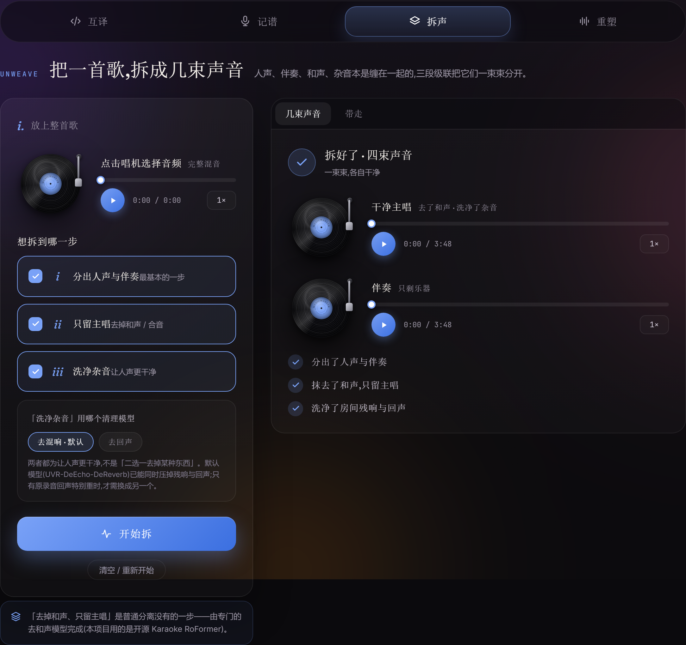
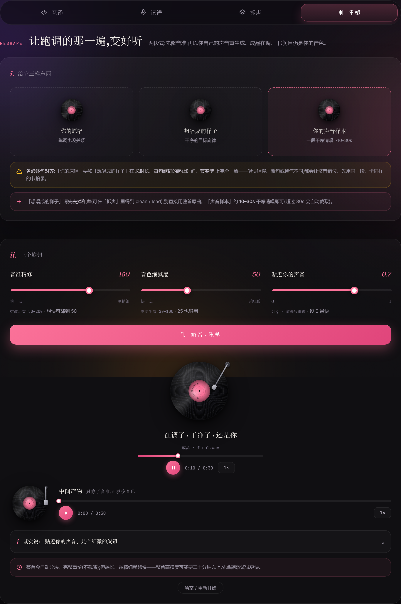
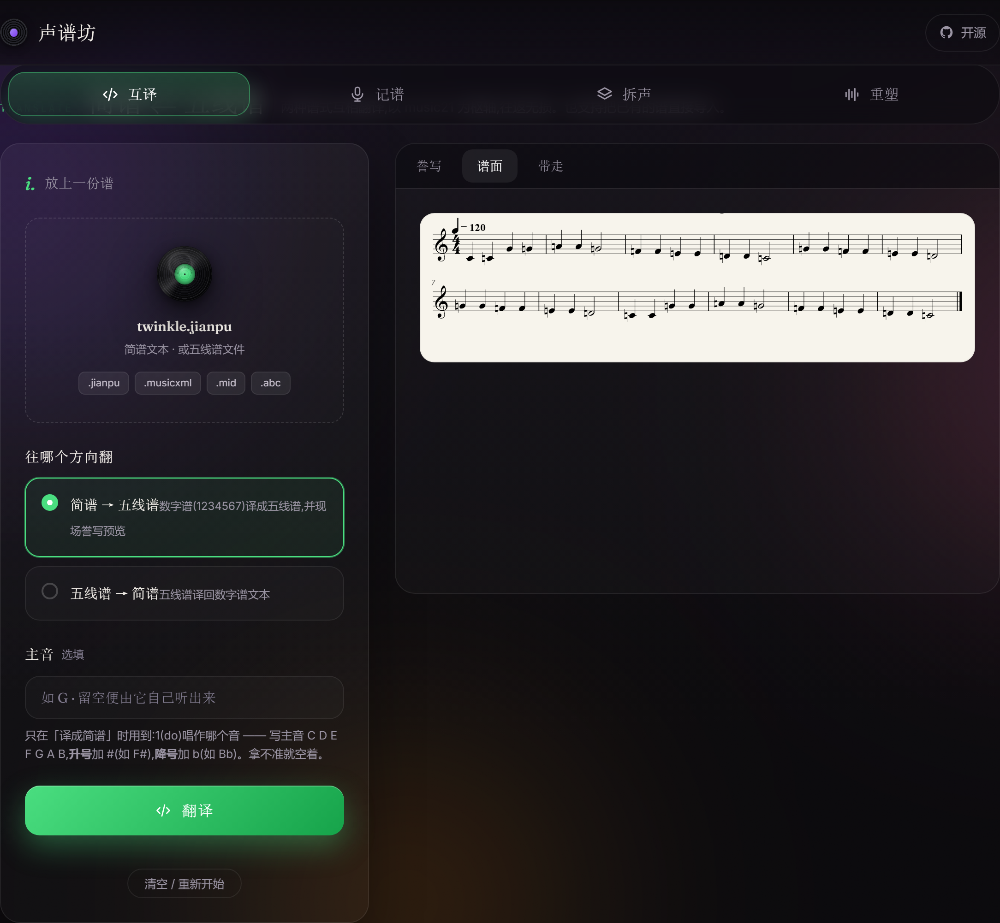
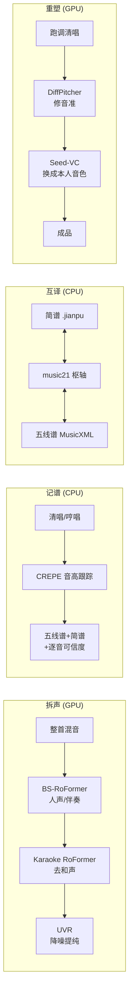
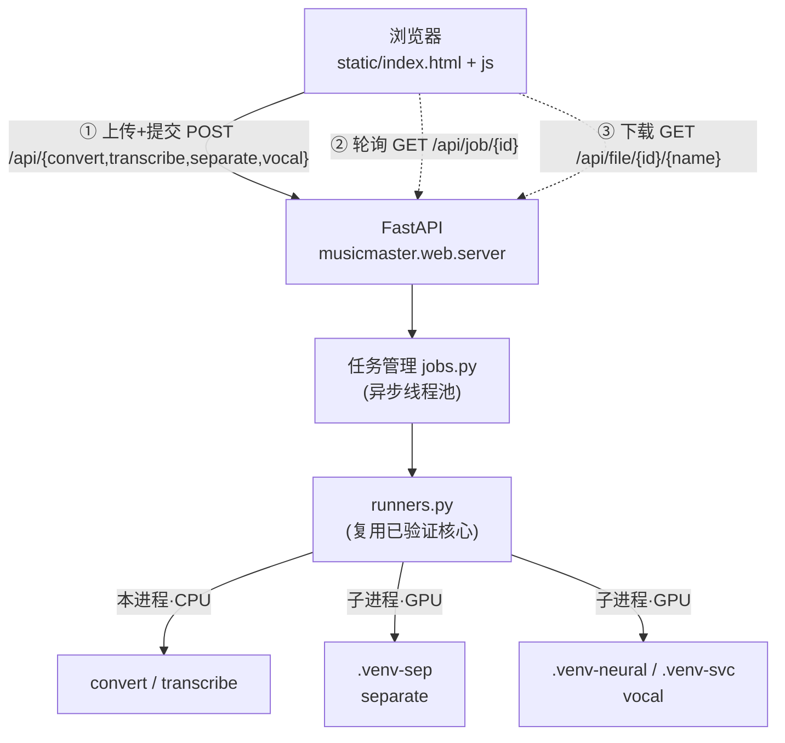

<div align="center">


# 声谱坊 · MusicMaster

**中文** · [English](README.en.md)

### 一个纯本地运行的浏览器工具,把一线开源音乐 AI 整合进一个暖墨色界面 ——<br/>四个页签覆盖**拆声 · 记谱 · 简谱⇄五线谱互译 · 修音换音色**。

*四项能力,一个界面,全部在本地运行。*

[](LICENSE)
[](NOTICE)
[](pyproject.toml)
[](#快速开始)
[](#纯本地--命令行--许可清单)
[](https://github.com/Cohenjikan/MusicMaster/stargazers)

<br/>


<sub>完整宣传片:<a href="docs/assets/promo.mp4">docs/assets/promo.mp4</a></sub>

</div>

---

> **扒谱不必再依赖反复试听:输入清唱,输出五线谱、简谱与逐音可信度。**
> 跑调的清唱,可修正为在调、干净、且仍保留本人音色的版本。
> 代码以 Apache-2.0 开源,许可清单完整明确,包括明确标注哪些权重不可商用。

它并非单一模型的封装,而是把 **BS-RoFormer、Mel-Band Karaoke RoFormer、UVR、CREPE、basic-pitch、ByteDance、DiffPitcher、Seed-VC、music21、Verovio** 等多个一线开源模型,编排成四条**经过验证**的流水线。本项目只做**编排与桥接**,不修改上游推理配方。

**适用人群:** 业余歌手、音乐爱好者、需要扒谱(把歌曲转成乐谱)的人,以及注重本地处理与隐私的用户。

---

## 功能概览

| 能力 | 产出 | 算力 |
|---|---|---|
| **拆声 / Separate** | 一首歌 → 人声 / 伴奏 → 去和声纯主唱 → 降噪干净主唱,多束产物逐束对比;可用于卡拉OK,或将干净主唱用于扒谱、重塑 | GPU |
| **记谱 / Transcribe** | 清唱 / 哼唱 → 五线谱 + 简谱 + **逐音可信度**;不确定之处自动标出,只需复核这几个音,无需盲信全谱 | CPU |
| **互译 / Convert** | 简谱 `.jianpu` ⇄ 五线谱 `MusicXML`,核心音级序列往返**无损**;简谱可导出 MuseScore / Finale 可打开的乐谱,五线谱可译回数字简谱 | CPU |
| **重塑 / Vocal** | 跑调清唱 → **在调 + 干净 + 仍保留本人音色**(两段式:修音准 → 换回本人音色) | GPU |

> 打开后是一个网页界面(由本地 FastAPI 服务托管),四个页签对应上述四项能力。
> **互译 / 记谱** 为纯 CPU 功能,安装主环境后即可使用;**拆声 / 重塑** 需额外配置 GPU 环境(见下文),未配置时这两页仅给出提示,不影响 CPU 两页。

<div align="center">
<table>
<tr>
<td></td>
<td></td>
</tr>
<tr>
<td align="center"><sub>拆声(蓝)</sub></td>
<td align="center"><sub>记谱(琥珀)</sub></td>
</tr>
<tr>
<td></td>
<td></td>
</tr>
<tr>
<td align="center"><sub>互译(绿)</sub></td>
<td align="center"><sub>重塑(粉)</sub></td>
</tr>
</table>
</div>

---

## 项目特点

- **并非单一模型的封装** —— 把多个一线开源模型编排成四条**经过验证**的流水线,本项目只做编排与桥接,不修改上游推理配方。
- **记谱提供逐音可信度并主动标注存疑** —— 多数扒谱工具只输出一份乐谱,不会指出哪些音不可信。本项目对成串的调外音标记为「存疑」,且**措辞中立**(可能扒错,也可能确实唱了变化音),不做武断判定。
- **许可信息透明** —— 代码为干净的 Apache-2.0,同时把「哪些模型权重为非商用」写入 README 与 NOTICE,作为**可信度的一部分**,而非含糊带过。
- **面向中文 / 简谱用户** —— 原生支持数字简谱(`.jianpu`)与简谱 PDF 出图(需本机安装 LilyPond),并能与国际通用的 MusicXML 双向互译;这是面向中文音乐爱好者的少见组合。
- **纯本地、隐私优先** —— 音频在本机处理,GPU 重负载运行于独立 venv 以隔离依赖冲突,CPU 能力开箱即用。
- **重塑保留本人音色,而非克隆为他人** —— 以本人清唱作为音色锚,仅修正音准并提纯,身份不漂移(红线测试锁定 `shift=-12`、`auto_f0_adjust=False` 等验证配方)。

---

## 快速开始

> 注意:请勿使用系统 Python 直接运行 —— 依赖安装在项目自带的虚拟环境 `.venv` 中。

```bash
git clone https://github.com/Cohenjikan/MusicMaster.git
cd MusicMaster

# 1) 一键建立主环境(CPU):创建 .venv + 安装 TensorFlow + crepe(--no-deps)+ 其余依赖 + 本包
python scripts/setup_core.py

# 2) 启动(Windows:双击 启动.bat;命令行同样可用)
启动.bat
# macOS / Linux:
./start.sh
```

启动后浏览器自动打开 **`http://127.0.0.1:7860`**(端口被占用则自动顺延);四个页签即四项能力 —— 此时 **互译 / 记谱(crepe)** 已可使用。

> 至此,CPU 两页(互译 / 记谱)即可运行。拆声 / 重塑是可选的 GPU 增量,见下面两节。

**(可选)简谱出 PDF:** 本机安装 [LilyPond](https://lilypond.org)(GPL,仅作独立子进程调用),并设环境变量 `LILYPOND_EXE` 指向其可执行文件。未安装也可使用,只是简谱产出 `.ly` 源稿而非 PDF,五线谱(Verovio)不受影响。

---

## 使用前须知

以下是使用前应了解的边界与限制。

<table>
<tr><th>安装即可用(CPU)</th><th>需额外配置(GPU)</th></tr>
<tr>
<td valign="top">
互译 / 记谱 安装主环境后即可使用,无需 GPU。
</td>
<td valign="top">
拆声 / 重塑需 <code>scripts/setup_sep.py</code> + <code>scripts/setup_vocal.py</code> 建立独立 venv、拉取权重,建议显存 <b>≥ 8GB</b>;未配置时这两页仅给出提示。
</td>
</tr>
</table>

- **许可红线:** 项目**代码为 Apache-2.0,许可干净**;但**部分模型权重为非商用**(CC-BY-NC-SA / 视作非商用)—— 去和声 Karaoke RoFormer、ByteDance 钢琴(MAESTRO)、Demucs(MUSDB18)。**个人 / 研究免费;商用须替换这些权重或单独取得授权。**
- **Copyleft 不传染:** Verovio 为 LGPL(作为动态库加载);LilyPond / FFmpeg 为 GPL(视构建也可能为 LGPL,本项目仅作独立 CLI 子进程调用)—— **均不静态链接,不传染本项目代码**。
- **记谱 ~88/100 不是通用准确率:** 它是某副歌**对照权威谱的单次样例**;只有**合成音阶**为逐音精确。请勿将其当作对所有歌曲的保证。
- **重塑修正的是本人音色:** 它把跑调清唱修准并保留 / 还原为**本人**音色(self 音色锚),**不是任意目标歌手的音色克隆**;`cfg`(贴近本人声音)旋钮的官方定位是「**细微**」,调节作用有限。整首高精度可能需 **20 分钟以上**。
- **互译的范围说明:** MIDI / ABC 在代码中是 music21 可**读入**的输入格式;**经验证的无损往返仅为 简谱 → MusicXML → 简谱(逐字一致)**;输出侧只产 MusicXML 或 `.jianpu` 文本。
- **非实时处理:** 分离可能数分钟,整首高精度重塑可能 20 分钟以上。GPU 任务请耐心等待。
- **验证环境单一:** 以上结论在 Windows / Python 3.11 / RTX 4060 Laptop 8GB / CUDA 12.4 上验证。

---

## 四项能力详解

### 拆声 / Separate —— 三段级联人声分离(GPU)

> **能力:** 输入一首歌曲,自动得到「人声 / 伴奏 / 去和声纯主唱 / 降噪干净主唱」多束产物。可制作卡拉OK,或将干净主唱用于扒谱、重塑,并可逐束对比挑选最合适的产物。

**实现:** `separate/pipeline.py` 三段按序级联 ——
`stage_separate`(**BS-RoFormer** `model_bs_roformer_ep_317`)→ `stage_deharmony`(**Mel-Band Karaoke RoFormer** `gabox_v2`)→ `stage_denoise`(**UVR-DeEcho-DeReverb** 默认 / `De-Echo-Normal`)。用户可选 `--stages` 子集;`runners.run_separate` 流式解析子进程进度,产物经 `runners._friendly()` 标注「人声含和声 / 去和声主唱 / 降噪干净 / 伴奏 / 最终」。

> 主分离链路是 **BS-RoFormer → Karaoke RoFormer → UVR**;Demucs 只是 `core` 中的**备选**分离器,并非主链。

**清理模型如何选择** —— 两个清理模型都是为了让人声更干净,**并非「二选一去掉某种东西」**:

- **去混响(dereverb,默认)** —— `UVR-DeEcho-DeReverb`,可同时压制残响与回声,音量稳定、不发闷;
- **去回声(deecho)** —— 仅在原录音回声特别重时才换用。

### 记谱 / Transcribe —— 清唱 / 哼唱转五线谱 + 简谱 + 逐音可信度(CPU)

> **能力:** 不会扒谱的人也能把自己唱的旋律转成乐谱。系统先对录音做质量检测,再把**不确定的几处自动标出**,使用者只需复核这几个音,而非盲信全谱。逐音可信度面板见上方「记谱(琥珀)」页签截图。

**实现:** `transcribe/autopilot.py` 串联 **L1** `quality_gate.assess`(入口质量检测)→ 选择引擎转录(`crepe` 默认)→ 稳健定调 → 渲染 MIDI / MusicXML / 五线谱 / 简谱 → **L3** `confidence.assess`。`confidence.py` 用「乐理合理性 × 双算法分歧 × 跟踪自信 × 全局门」计算逐音可信度,只对成串的调外音标记为「存疑」并**措辞中立**(可能扒错,也可能确实唱了变化音);`runners._parse_confidence` 动态解析 `confidence.json` 的 `passages[start_s, end_s, reasons, min_conf]`。测试 `test_transcribe_synthetic_scale_crepe` 断言合成音阶逐音精确。

**记谱按素材选择引擎** —— 选错不会崩溃(入口先检测素材):

| 素材 | 引擎 | 说明 |
|---|---|---|
| 歌声 / 哼唱 / **单旋律** | `crepe`(默认) | 单旋律深度音高跟踪,人声最稳,**并能输出简谱 + 逐音可信度**(纯 CPU) |
| 乐器 / 和弦 / **多个音同时** | `basic-pitch` | 通用复音音符检测;**人声不建议使用**。需 TensorFlow 2.15 |
| **干净的钢琴独奏** | `bytedance` | 钢琴专用高分辨率;**仅限干净 44.1k 真实钢琴**,低质音频会产生幻觉假音 |

> 复音引擎(`basic-pitch` / `bytedance`)**仅输出五线谱**,不输出简谱与可信度 —— 简谱 + 逐音可信度是 `crepe` 单旋律链路独有。

### 互译 / Convert —— 简谱与五线谱双向互译(CPU)

> **能力:** 简谱与五线谱用户各取所需 —— 简谱文本可转成 MuseScore / Finale 可打开的 MusicXML,五线谱可译回数字简谱,且**核心音级序列往返不丢失**。

**实现:** `convert/convert.py` 以 **music21.Score** 为枢轴:`parse_jianpu` 解析 `.jianpu` 迷你格式(调号 / 拍号 / 节奏 / 升降 / 八度),`score_to_jianpu` 反向译出并 `stripTies` 合并连音;`load_any` 还可**读入** MusicXML / MIDI / ABC。测试 `test_convert_roundtrip_lossless` 断言 `twinkle.jianpu → Score → jianpu` 开头音级「`1 1 5 5 6 6 5`」一致。

> 经验证的无损往返是 **简谱 → MusicXML → 简谱(逐字一致)**;MIDI / ABC 是**导入**格式,输出侧只产 MusicXML 或 `.jianpu`。

<div align="center">

<br/><sub>真实运行 · 简谱 <code>twinkle.jianpu</code> → 五线谱(Verovio 现场渲染)</sub>
</div>

### 重塑 / Vocal remix —— 跑调清唱修成在调、干净、仍保留本人音色(GPU)

> **能力:** 业余跑调的清唱可被修正为音准在调、干净,而且**音色仍是本人** —— 不会变成他人的声音。

**实现:** `vocal/pipeline.py` 的 `two_stage` ——
**Stage 1** `DiffPitcher` 修音准(`correct`,`shift=-12`,默认 150 步)→ 重采样 44.1k → **Stage 2** `Seed-VC` 以 `self_ref` 作音色锚换回本人(`voice`,默认 50 步,`cfg 0.7`)。`test_vocal_redlines_locked` 锁定这些默认值与 `auto_f0_adjust=False`(不自动移调,以免身份偏移)。`runners.run_vocal` 用中间产物(`corrected_24k/44k → vc` 成品)推断进度。

**三个输入(缺一不可,请勿混淆):**
1. **本人原唱**(跑调亦可);
2. **目标演唱效果** —— 目标旋律的**去和声**干净参考(可先用「拆声」从原曲分出 clean / lead,**请勿直接使用整首原曲**);
3. **本人声音样本** —— 一段约 10–30s 的干净清唱(作音色锚,决定成品「听起来是谁」)。

> 务必**逐句对齐**:① 与 ② 须在**总时长、每句起止、节奏型**上完全一致,否则修音会错位。

**三个旋钮:**
- **音准精修**(`扩散步数` 50–200,默认 150)—— 越大越精细但越慢,需要更快可降到 50;
- **音色细腻度**(`重塑步数` 20–100,默认 50)—— 越大越细腻但越慢,25 也足够;
- **贴近本人声音**(`cfg` 0–1,默认 0.7)—— 官方定位「**细微**」;若想更像本人,**优先换更干净 / 更长的「声音样本」并调高「音色细腻度」**,效果远比调节此旋钮明显。

> 整首会自动分块、完整重塑(不截断);但越长越精细越慢(整首高精度可能 20 分钟以上,先用副歌片段试更快)。

---

## 工作原理

**四项能力的输入与产物:**



**界面与后端如何连接:**



> 长任务(拆声、重塑)采用「提交 → 取 job_id → 轮询进度 → 完成后取结果 / 下载」模型,因此页面不会卡住(`JobManager` 进程内线程池异步执行)。下载端点 `/api/file/{id}/{name}` 带目录穿越防护;默认 `127.0.0.1:7860`(`MUSICMASTER_HOST` 可改、占用则顺延 `_free_port`)。
> 更细的「每一层用了哪些模型」流程图见 **[docs/架构流程图.md](docs/架构流程图.md)**。

---

## 界面设计

界面经过专门设计,使用起来更有质感,区别于框架默认的通用样式。

- **暖墨深色主题 + Fraunces 衬线字体**(自托管 woff2,`@font-face`;中文走系统衬线回退)。
- **旋转黑胶 `.vinyl`(沟纹 / 反光 / 唱片标)+ 唱臂 `.tonearm`** 随播放抬落 —— 它本身就是音频播放器。
- **每页签独立配色** `--accent`:互译 `#4ade80` 绿 · 记谱 `#fbbf24` 琥珀 · 拆声 `#7aa2f7` 蓝 · 重塑 `#fb7299` 粉。

> 实现见 `musicmaster/web/static/index.html`。

---

## GPU 功能设置(拆声 / 重塑)

这两类使用一线 GPU 模型,各有独立 venv(依赖互相冲突,**请勿混装**):

```bash
python scripts/setup_sep.py      # 分离环境 .venv-sep(audio-separator + CUDA torch)
python scripts/setup_vocal.py    # 修音 .venv-neural(DiffPitcher) + 换音色 .venv-svc(Seed-VC) + 拉取权重
```

脚本会在 `vendor/` 下拉取源码、建立对应 venv、下载权重。完成后把路径告知程序(优先级:**环境变量 > `paths.local.json`**):复制 `paths.local.json.example` 为 `paths.local.json` 并填好(使用正斜杠 `/`),该文件不入库,启动时自动读取。

| `paths.local.json` 键 / 环境变量 | 指向 |
|---|---|
| `sep_python` / `MUSICMASTER_SEP_PYTHON` | 分离 venv 的 python(.venv-sep) |
| `diffpitcher_dir` / `MUSICMASTER_DIFFPITCHER_DIR` | DiffPitcher 目录(含 run_qt4 + ckpts) |
| `vocal_python` / `MUSICMASTER_VOCAL_PYTHON` | 修音 venv 的 python(.venv-neural) |
| `seedvc_dir` / `MUSICMASTER_SEEDVC_DIR` | Seed-VC 目录(含 inference.py) |
| `svc_python` / `MUSICMASTER_SVC_PYTHON` | 换音色 venv 的 python(.venv-svc) |

> 显存建议 **≥ 8GB**。未配置 GPU 环境时,这两页给出提示,**不影响 CPU 两页正常使用**。

---

## 命令行(不开界面也能用)

```bash
musicmaster gui                                   # 启动本地 Web 界面(= python -m musicmaster.web.server)
musicmaster transcribe 清唱.wav --out 输出 --engine crepe --key C   # 扒谱
musicmaster convert 某.jianpu --to musicxml --render               # 互译
musicmaster render 某.musicxml -o 输出                              # 渲染(MusicXML → 五线谱+简谱)
musicmaster separate 混音.wav --stages 1,2,3                        # 分离(需 GPU venv)
python -m musicmaster.vocal.pipeline --raw 清唱.wav --ref 去和声.wav --self 你的清唱.wav --out 输出  # 重塑(需 GPU venv)
```

---

## 纯本地 · 命令行 · 许可清单

- **音频不离开本机** —— `127.0.0.1` 本地服务,只有首次模型权重才联网下载;隐私友好。
- **可脱离界面用 CLI 批处理** —— `musicmaster/cli.py` 提供 `gui / transcribe / convert / render / separate / vocal` 子命令。
- **许可清单完整明确** —— `LICENSE` 为 Apache-2.0,`NOTICE` 逐条标注组件角色与许可(Karaoke RoFormer / Demucs MUSDB18 / ByteDance MAESTRO 标注非商用,Verovio LGPL 动态库、LilyPond / FFmpeg GPL 仅子进程)。

---

## 项目结构

```
MusicMaster/
├─ 启动.bat / start.sh          # 启动器:起本地 Web 服务并打开浏览器(主入口)
├─ README.md / README.en.md     # 说明(中 / 英)
├─ LICENSE · NOTICE             # Apache-2.0 + 第三方组件/模型署名与许可
├─ pyproject.toml               # 包与依赖声明(含 pytest 配置)
├─ musicmaster/                 # ← 源码本体
│  ├─ web/                      # FastAPI 桥接层
│  │  ├─ server.py              #   路由:静态托管 + /api 提交/轮询/下载
│  │  ├─ jobs.py                #   进程内异步任务管理
│  │  ├─ runners.py             #   四功能执行体(复用已验证核心)
│  │  └─ static/               #   设计稿前端:index.html + js/ + 自托管字体
│  ├─ separate/                 # 三段式人声分离(audio-separator,GPU)
│  ├─ transcribe/              # 记谱:质量门 → 多引擎 → 定调 → 渲染 → 可信度
│  ├─ convert/                 # 简谱 ⇄ 五线谱 互译与导入
│  ├─ vocal/                   # 修音(DiffPitcher)+ 换音色(Seed-VC)子进程包装
│  └─ core/                     # 共享底座:数据契约 + 谱面渲染(Verovio / jianpu-ly)
├─ scripts/                     # setup_core / setup_sep / setup_vocal
├─ requirements/                # 分层依赖(core / sep / vocal)
├─ tests/                       # pytest(契约 / 互译往返 / 合成扒谱 / 渲染 / 红线锁)
├─ docs/                        # 架构流程图.md · 前端开发文档.md · 合并开发日志.md
└─ examples/                    # 示例(twinkle.jianpu,公有领域)
```

---

## 依赖与许可证

MusicMaster **本体代码以 [Apache-2.0](LICENSE) 开源**,运行时集成下列第三方组件与模型(完整清单与角色见 [NOTICE](NOTICE)):

| 环节 | 主要组件 | 许可证 |
|---|---|---|
| 拆声 | [audio-separator](https://github.com/nomadkaraoke/python-audio-separator) · BS-RoFormer · Mel-Band Karaoke RoFormer · UVR · [Demucs](https://github.com/facebookresearch/demucs)(备选) | MIT(代码);部分**权重 CC-BY-NC-SA** |
| 记谱 | [CREPE](https://github.com/marl/crepe) · [torchcrepe](https://github.com/maxrmorrison/torchcrepe) · [basic-pitch](https://github.com/spotify/basic-pitch) · [ByteDance 钢琴转录](https://github.com/qiuqiangkong/piano_transcription_inference) · [music21](https://github.com/cuthbertLab/music21) · [librosa](https://github.com/librosa/librosa) | MIT / Apache-2.0 / BSD-3 / ISC;ByteDance **权重 CC-BY-NC-SA** |
| 渲染 | [Verovio](https://github.com/rism-digital/verovio) · [jianpu-ly](https://github.com/ssb22/jianpu-ly) · [LilyPond](https://lilypond.org) | LGPL-3.0(库)/ Apache-2.0 / GPL-3.0(仅子进程) |
| 重塑 | [DiffPitcher](https://github.com/haidog-yaqub/DiffPitcher) · [BigVGAN](https://github.com/NVIDIA/BigVGAN) · [Seed-VC](https://github.com/Plachtaa/seed-vc) · [pyworld](https://github.com/JeremyCCHsu/Python-Wrapper-for-World-Vocoder) | 多为 MIT / Apache-2.0 |
| 界面 | [FastAPI](https://github.com/fastapi/fastapi) · Uvicorn · Starlette · Pydantic · python-multipart | MIT / BSD-3 / Apache-2.0 |
| 字体 | [Fraunces](https://github.com/undercasetype/Fraunces) · [Inter](https://github.com/rsms/inter) · [JetBrains Mono](https://github.com/JetBrains/JetBrainsMono) | SIL Open Font License 1.1 |

### 许可证兼容性

- **代码侧全部兼容 Apache-2.0 分发**:MIT / BSD-3 / ISC / Apache-2.0 宽松许可可直接集成;**Verovio(LGPL)作为动态库加载**、**LilyPond / FFmpeg(GPL)仅以独立 CLI 子进程调用** —— 均不静态链接,copyleft 不传染本项目代码。
- **商用提示(关键):** 部分**模型权重**为 **CC-BY-NC-SA(非商用)** —— 去和声 Karaoke RoFormer、ByteDance 钢琴(MAESTRO)、Demucs(MUSDB18)等。**个人 / 研究可自由使用**;若要**商用**,请把这几项替换为可商用权重或单独取得授权(本项目代码本身不受影响)。
- 自托管字体均为 OFL 1.1,允许随软件捆绑分发(已随附各自许可证全文于 `musicmaster/web/static/fonts/`)。

---

## 已验证

- 互译往返**无损**(简谱 → MusicXML → 简谱 逐字一致);
- 记谱端到端(合成音阶逐音精确;真实副歌 vs 权威谱 ~88/100 单次样例,**非通用准确率**);
- 五线谱(Verovio)渲染正常;简谱(LilyPond)出 PDF;
- 修音换音色两段式 GPU 全链路跑通(DiffPitcher → Seed-VC);
- Web 界面四页签端到端验证(上传 → 提交 → 轮询 → 结果 / 下载)。

环境:Windows / Python 3.11 / RTX 4060 Laptop 8GB(CUDA 12.4)。

---

## 致谢

MusicMaster 集成了上述众多优秀的开源项目与模型,将其整合进一个开箱即用的本地工具,在此一并致谢。各组件版权归其作者所有,按其各自许可证分发;本项目仅做编排与桥接,不修改任何上游验证过的推理配方。

---

<div align="center">

**一体化的本地音乐工坊。**
[Star on GitHub](https://github.com/Cohenjikan/MusicMaster) · [English README](README.en.md)

<sub>MusicMaster · 开源项目 · 代码 <a href="LICENSE">Apache-2.0</a> · 权重见 <a href="NOTICE">NOTICE</a> · 请仅处理你拥有权利或已获授权的音频</sub>

</div>
