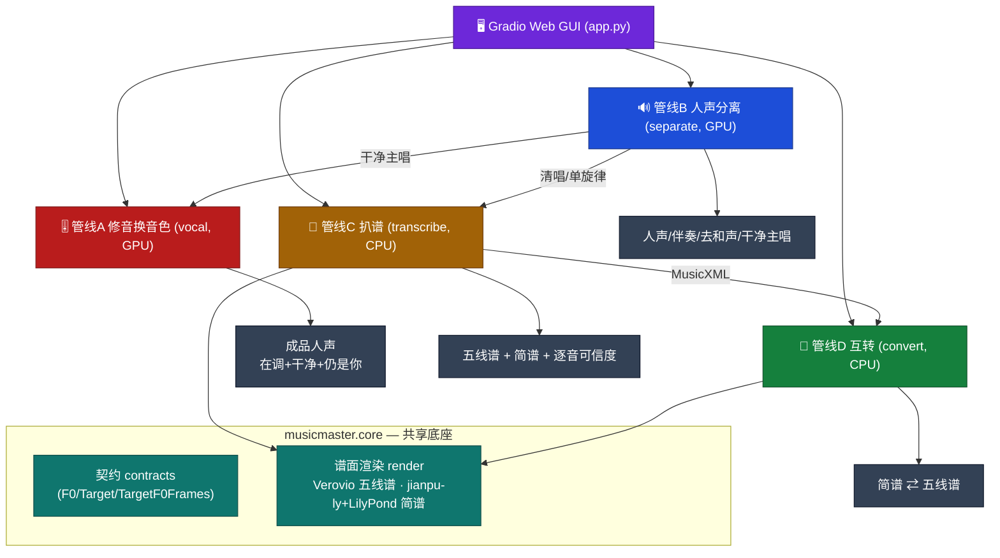
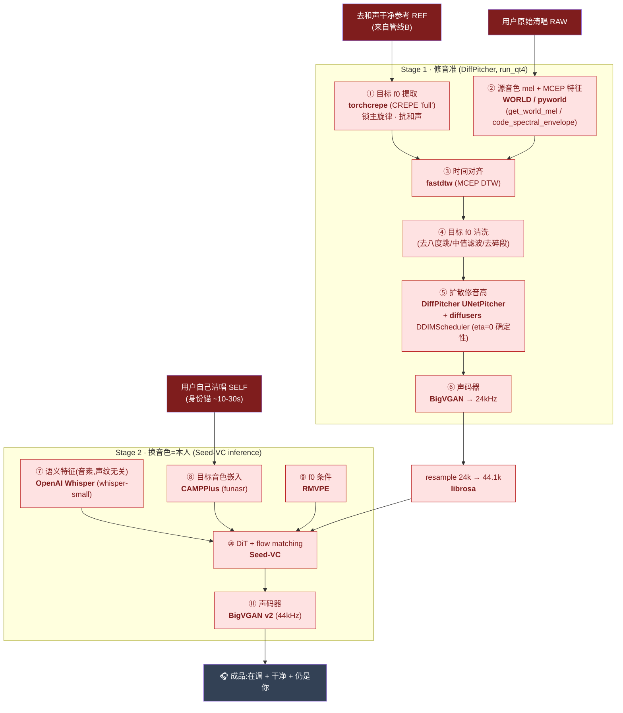
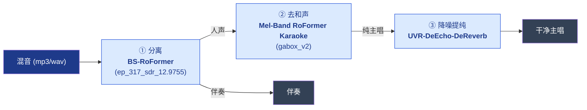
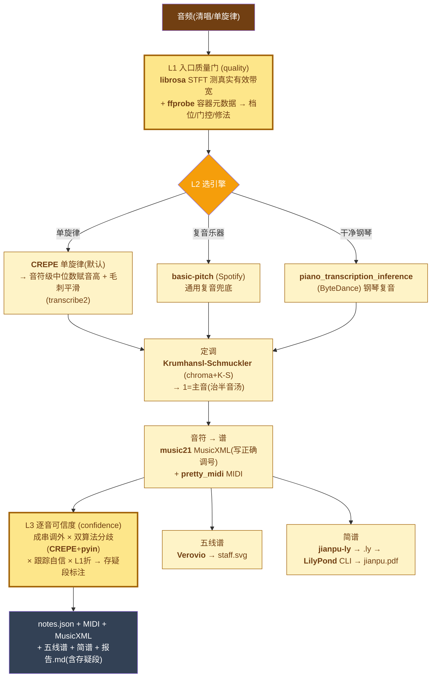
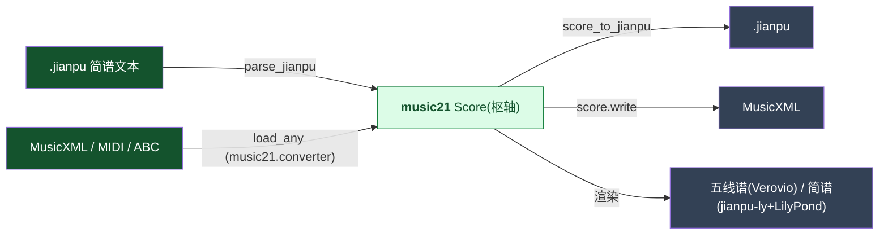
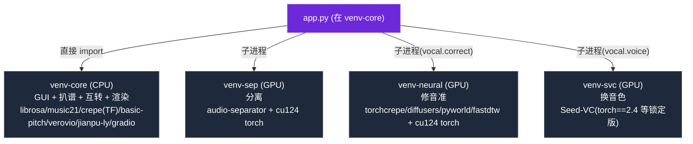

# 🗺️ MusicMaster 完整架构与数据流程图

> 本文逐管线列出**每一层过滤/处理用到的开源项目、模型与技术**(含许可证)。
> 四条管线共享 `core`(契约 + 谱面渲染)底座;GUI(Gradio)在最上层把它们串起来。
> 渲染说明:本文用 [Mermaid](https://mermaid.js.org/) 流程图,GitHub / VS Code 可直接预览。

---

## 0. 总览(一张图看全貌)

**模块互通**:分离(B)产出的「去和声干净主唱」既喂给修音(A)当目标旋律参考,也可当扒谱(C)的清唱输入;扒谱(C)产出的 MusicXML 可进互转(D);C/D 都用 core 的渲染层出图。

---

## 1. 管线 A — 修音换音色(`musicmaster.vocal`,GPU)

把**跑调清唱**修成「**在调 + 干净 + 仍是本人音色**」。两段式:先修音准(保音色只改音高),再用 SVC 以**用户自己的声音**重生成(洗掉瑕疵、补弱唱)。

**关键设计(血泪经验)**:
- 目标 f0 用 **torchcrepe** 而非 WORLD dio —— dio 在副歌高音区会跟错和声(跳三五度),导致「高音发哑」;CREPE 锁主旋律。**所以 REF 必须先去和声**(管线 B 的第 2 段)。
- 扩散 **eta=0**(确定性 DDIM)去帧间抖;声码器用 **BigVGAN**(神经)而非纯 DSP,消除 WORLD 重合成的「坑洼/电音」。
- Stage 2 的 SVC 目标音色 = **用户自己**(不是明星)→ 产品定位是「身份保留型美化」,且重生成天然洗掉颤音/失真、补弱唱段。

---

## 2. 管线 B — 人声分离(`musicmaster.separate`,GPU)

三段级联,统一经 **audio-separator** 后端(MIT)加载/推理/下权重。各段可单独启停。

| 段 | 默认模型 | 备选(经 audio-separator) | 作用 |
|---|---|---|---|
| 1 分离 | **BS-RoFormer** | Demucs htdemucs/_ft、karaoke_roformer | 混音 → 人声 + 伴奏 |
| 2 去和声 | **Karaoke Mel-Band RoFormer gabox_v2** | becruily、aufr33(实测抽水,不荐) | 人声 → 纯主唱(去 backing vocals) |
| 3 降噪 | **UVR-DeEcho-DeReverb** | UVR-De-Echo-Normal | 纯主唱 → 干净主唱(不闷) |

> 默认链由原项目盲听选定。普通分离(Demucs/Spleeter/BS-RoFormer)只分人声/伴奏、**不去和声**;真正「去 backing vocals」靠第 2 段的 Karaoke RoFormer。

---

## 3. 管线 C — 扒谱(`musicmaster.transcribe`,CPU,可选 GPU)

「去专家化外壳」:零调参 + 烂输入门口拦 + **绝不沉默地错(逐音标可信度)**。

**为什么三层**(原项目教训):坏录音上 CREPE 自信、pyin 有声、两算法一致**会同时失灵**(算法自信地异口同声地错),唯「成串调外/漂移」能暴露 → L3 的主信号就是它。L1 在门口就能拦下「8kHz 假冒 44.1k」的烂输入。**调外 ≠ 错**(真曲有变化音),故只对成串调外标「存疑」,绝不武断判错。

---

## 4. 管线 D — 互转(`musicmaster.convert`,CPU)

简谱文本 `.jianpu` 与五线谱 `MusicXML/MIDI/ABC` 双向**无损**互转,以 **music21.Score** 为枢轴;`load_any()` 统一导入(= 支持简谱/五线谱**导入**)。

实测:五线谱→简谱→五线谱 往返**音高完全一致**(本项目示例 `examples/twinkle.jianpu` 往返逐字无损)。

---

## 5. 开源技术总表(按层 / 项目 / 许可证 / 角色)

| 管线·层 | 开源项目 / 模型 | 许可证 | 角色 |
|---|---|---|---|
| **A 修音** 目标 f0 | torchcrepe (CREPE) | MIT | 锁主旋律抗和声的目标音高 |
| A 修音 音色/对齐 | WORLD / pyworld | MIT/改BSD | 源 mel、MCEP 特征 |
| A 修音 对齐 | fastdtw | MIT | 参考 f0 时间规整 |
| A 修音 扩散 | DiffPitcher (UNetPitcher) | MIT | 保音色改音高的扩散模型 |
| A 修音 调度 | diffusers (DDIMScheduler) | Apache-2.0 | 确定性采样(eta=0) |
| A 修音 声码器 | BigVGAN | MIT | mel → 24kHz 波形 |
| **A 换音色** 语义 | OpenAI Whisper (small) | MIT | 声纹无关音素特征 |
| A 换音色 音色 | CAMPPlus (funasr) | Apache-2.0 | 目标音色嵌入(身份) |
| A 换音色 f0 | RMVPE | MIT | 歌唱 f0 条件 |
| A 换音色 转换 | Seed-VC | 见上游 | DiT + flow matching 声线转换 |
| A 换音色 声码器 | BigVGAN v2 (44k) | MIT | mel → 44.1kHz 波形 |
| **B 分离** 后端 | audio-separator | MIT | 统一加载/推理/下权重 |
| B 分离 第1段 | BS-RoFormer | 见上游 | 人声/伴奏分离 |
| B 分离 第2段 | Mel-Band RoFormer Karaoke (gabox_v2) | 见上游(权重视非商用) | 去和声 |
| B 分离 第3段 | UVR DeEcho-DeReverb | 见上游 | 降噪/去混响 |
| B 分离 备选 | Demucs (htdemucs) | MIT(权重 MUSDB18 CC-BY-NC-SA) | 备选分离 |
| **C 扒谱** L1 | librosa + ffprobe(FFmpeg) | ISC / LGPL-GPL | 有效带宽/质量门 |
| C 扒谱 引擎① | CREPE | MIT | 单旋律 f0(默认) |
| C 扒谱 引擎① | pyin(librosa) | ISC | 备选/L3 副算法 |
| C 扒谱 引擎② | basic-pitch | Apache-2.0 | 通用复音兜底 |
| C 扒谱 引擎③ | piano_transcription_inference (ByteDance) | MIT码/MAESTRO权重 CC-BY-NC-SA | 钢琴复音 |
| C 扒谱 定调 | Krumhansl-Schmuckler | 公领域算法 | 自动定调写调号 |
| C 扒谱 谱生成 | music21 / pretty_midi | BSD-3 / MIT | MusicXML / MIDI |
| **C/D 渲染** 五线谱 | Verovio | LGPL-3.0 | MusicXML → SVG(作为库) |
| C/D 渲染 简谱 | jianpu-ly | Apache-2.0 | MusicXML → LilyPond .ly |
| C/D 渲染 简谱图 | LilyPond | GPL-3.0 | .ly → SVG/PDF(**仅独立子进程**) |
| **D 互转** 枢轴 | music21 | BSD-3 | 简谱 ⇄ 五线谱(含 MIDI/ABC 导入) |
| **GUI** | Gradio | Apache-2.0 | 单页 Web 界面 |
| 服务(可选) | FastAPI/Uvicorn/Celery/Redis/boto3 | MIT/BSD/Apache | REST API + 队列 + 对象存储 |

> 合规:LilyPond/FFmpeg 仅子进程调用、Verovio 作库加载;标注 CC-BY-NC-SA/非商用的权重(Karaoke RoFormer、Demucs MUSDB18、ByteDance MAESTRO)个人/研究可用,商用前需替换或单独授权。完整署名见 [`NOTICE`](../NOTICE)。

---

## 6. 运行环境与 venv 隔离

四类重依赖互相冲突(CPU torch vs CUDA torch、TensorFlow vs torch、audio-separator 固定 onnxruntime),因此**分 venv**:

GUI 跑在 `venv-core`:同 venv 的扒谱/互转**直接函数调用**;跨 venv 的分离/修音换音色**子进程调用**(路径由环境变量配置,见 README)。
